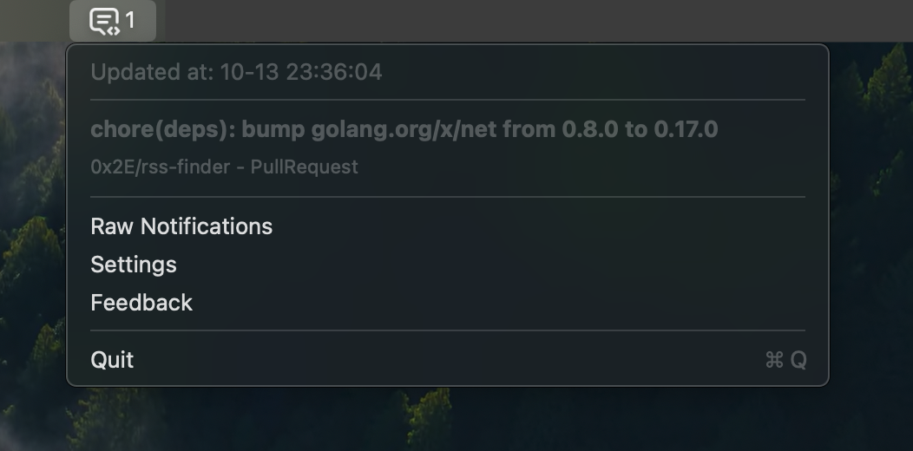

# GitStatus

Show GitHub notifications on menubar (macOS 13.0+).

  

## Credits

- vector icon in app logo: [bytedance/IconPark](https://github.com/bytedance/IconPark)
- vector icon in menubar: [tabler-icons](https://tabler-icons.io/i/message-2-code)
- figma plugin: [Xcode App Icon Exporter](https://www.figma.com/community/plugin/1100675815076145179/xcode-app-icon-exporter)
